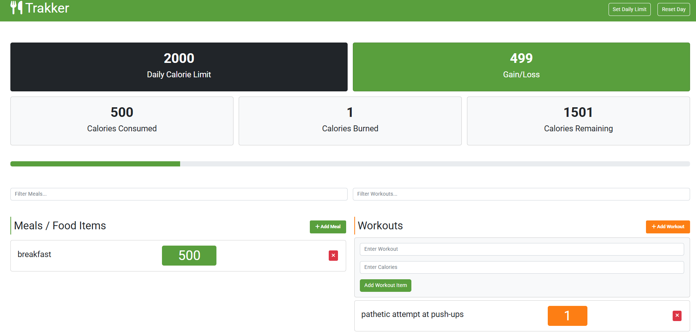

# OVERVIEW

A vanilla Javascript based calorie tracker web-app. The code here demonstrates Object Oriented Programming in Javascript ES6 using 2022 syntax and local storage for data. 

It's also a great learning tool for understanding the misery of not having a reactive framework to work with for the front-end. 

# RUNNING THE APP

* You will need to have NPM installed (https://docs.npmjs.com/downloading-and-installing-node-js-and-npm)
* Clone the repo code
* Navigate to the root of the repo
* Run `npm i` and then `npm run build`